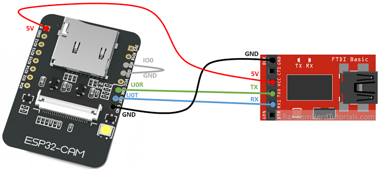

# Wireless Camera

The wireless camera firmware creates a webserver that streams a M-JPEG video over Wi-Fi. A matching software on the same LAN  (Wi-Fi or ethernet) can connect to the local IP of the device and receive the M-JPEG stream until the client terminates the connection. It is also possible to view the M-JPEG stream on a browser.

Only one connection is possible at a time.

In order to simultaneously operating multiple camera in a production setting. A DIP switch is used to set the IP address of the device. 

A status LED indicates when Wi-Fi is connected. The front flash light is turned on (not at full power) when the controller is streaming.


## Micro-controller

**Board Variant:** AI-Thinker ESP32-CAM 
**Board Input Voltage:** DC5V
**Camera Module:**  OV2680

Tx, Rx and IO0 is only wired to FTDI serial breakout for programming and serial debugging.

## Firmware Installation (AI Thinker ESP32 CAM)

Make connections aa follows:



In Arduino IDE, open `esp32cam_firmware.ino` : 

   - Select Board "AI Thinker ESP32-CAM"
   - GPIO 0 must be connected to GND to upload a sketch
   - After connecting GPIO 0 to GND, press the ESP32-CAM on-board RESET button to put your board in flashing mode
   - Upload


Confirm by opening Serial Monitor at selected COM port: 

```
Camera initialized.....
WiFi connected
Camera Stream Ready! Go to: http://192.168.1.2
```


The video streaming firmware is a fork of www.github.com/bnbe-club/rtsp-video-streamer-diy-14 (YouTube Video: https://youtu.be/1xZ-0UGiUsY). The M5CAM support is coded by https://github.com/bokse001 

The options `ENABLE_WEBSERVER` and `ENABLE_RTSPSERVER` are both enabled. However, we found the webserver to be much faster without delay.


## Address Control

Jumpers can be inserted in between the following pins to change its default IP address.

| Address                                  | IO14 | IO15 | IO13 | IO12 |
| ---------------------------------------- | ---- | ---- | ---- | ---- |
| 192.168.1.100 (Robot Flange Toolchanger) |      |      |      |      |
| 192.168.1.101 (Clamp CL3 c1)             | J1   | J1   |      |      |
| 192.168.1.102 (Clamp CL3 c2)             |      |      | J2   | J2   |
| 192.168.1.103 (Clamp CL3M c3)            | J1   | J1   | J2   | J2   |
| 192.168.1.104 (Clamp CL3M c4)            |      | J1   | J1   |      |

## Validation Experiments

There are a few slightly different MJPEG video streaming server from :

- www.github.com/bnbe-club/rtsp-video-streamer-diy-14
- https://github.com/arkhipenko/esp32-mjpeg-multiclient-espcam-drivers
- https://github.com/arkhipenko/esp32-cam-mjpeg

The one from **bnbe-club** is the only one that works with OpenCV marker detection. The reason is not known. However it supports only one HTTP client at a time.

The other two controller from **arkhipenko** supports multiple clients, I can view streaming from multiple browser windows and also from OpenCV. However the marker tracking does not work.

## Firmware Configuration

`video_speed_test.py` in `clamp_controller` repo is used to test the FPS of the received image frame.

With the `bnbe-club/rtsp-video-streamer-diy-14` firmware in /firmware folder. The following settings can be made:

```
config.xclk_freq_hz = 16000000; //Reduced from 20000000
config.pixel_format = PIXFORMAT_JPEG;
config.frame_size = FRAMESIZE_UXGA; //1600 x 1200
config.jpeg_quality = 12;
config.fb_count = 2;
```

`jpeg_quality` set at 12 according to https://github.com/espressif/esp32-camera/issues/185. Technically a larger number will better avoid memory overflow problem. But 12 seems to work.

`xclk_freq_hz` reduced from 20000000 according to https://github.com/espressif/esp32-camera/issues/291. The value is reduced to make sure the camera is slow enough for the CPU to write all the stuff to buffer. Otherwise strips or incomplete image will occur. 

The above settings allows a reception at OpenCV side at **~ 4FPS** The delay is visible 
