# Motor11_PID_Tuning_SL1

This experiment is to tune the main motor of the SL1 Screwdriver. 

the motor controller (Arduino Sketch) is copied from `\clamp_controller\05_MotorTestingController` and customized for SL1 Hardware. The limit switch definition is removed.

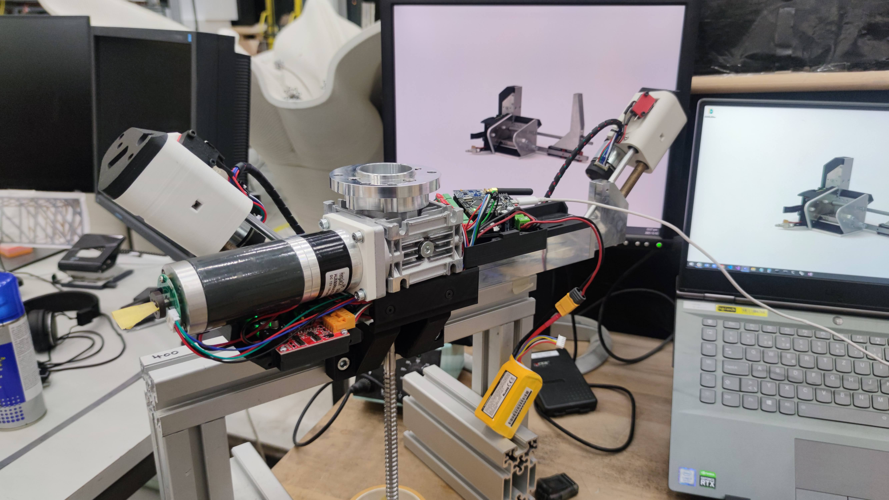

## Initial Speed Test

First test is to determine the maximum possible velocity achievable. 

- Without load (no screw friction in wood)
- Low acceleration
- 4 cell battery (@ 16.3V ~ 80%)

Parameters: `a5000` `e400` `kp0.01` `ki0.04` `kd0.0002` 

| Velocity (v) (step / sec) | Power at constant Speed (%) |
| ------------------------- | --------------------------- |
| 7000                      | fail ~ 1000ms               |
| 6500                      | fail ~ 1000ms               |
| 6000                      | 75% - 100%                  |
| 5500                      | 50% - 70%                   |
| 5000                      | 30% - 55%                   |
| 4500                      | 25% - 40%                   |
| 4000                      | 20% - 35%                   |
| 3500                      | 10% - 28%                   |
| 3000                      | 0 % - 25%                   |

## Determining Max Speed / Typical Speed

The HJX50RNA27i motor + 1:49 planetary gear box : one turn at planetary = 2960 steps. together with the 1:20 worm gearbox, the **step/rev is : 28428 ** (+ve dir tightens screw in). The main screw has a **5mm pitch**.

For a linear speed of 1mm/s screwdriver advancement, motor step velocity will be  (28248 / 5 * 1) steps/sec = **v5685** (however, this is not achievable, see above.)

Below graph = **v5920** (~ 1.04mm/s)

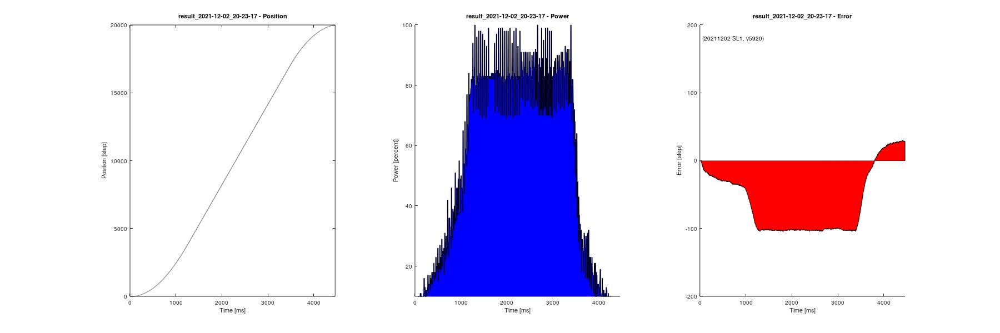

 Below graph = **v4736** (~50% power) (0.84mm/s)

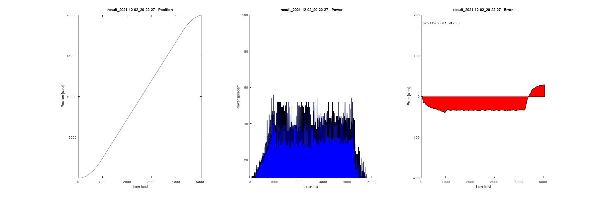

Below graph is = **v4144** (More torque maybe) (0.73mm/s)

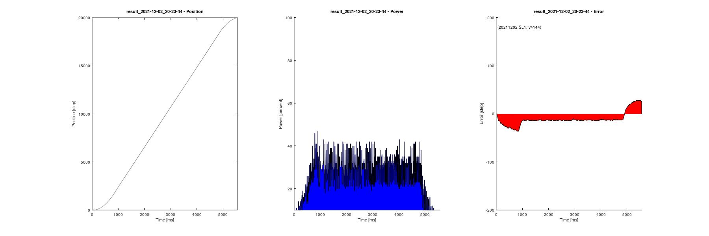

Conclusion: We will perform the following tuning at **v4736** (~0.84mm/s advancement)

## Determining Acceleration

Acceleration 10000 (reasonable)

Acceleration 15000 (reasonable)

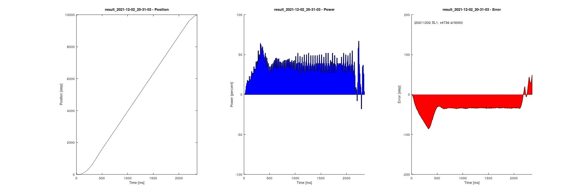

Acceleration 20000 (acceleration phase power higher than constant speed phase)

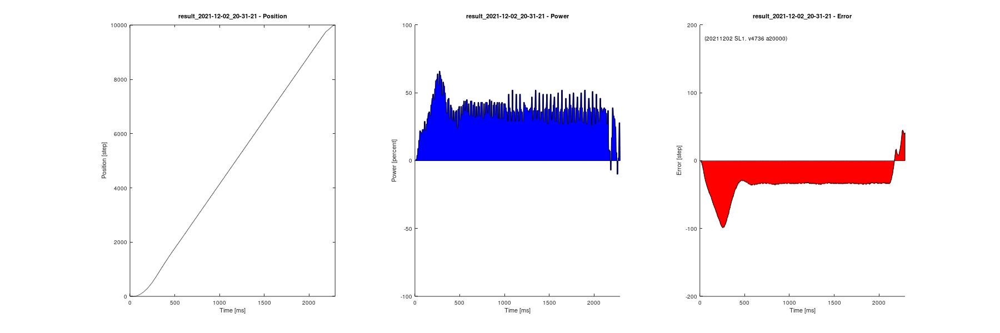

Acceleration 30000 (acceleration phase power substantially higher than constant speed phase)

Conclusion: conservatively allow room for accelerating under load, the acceleration is set to **a10000**

## PID Tuning

Fixed parameter: `v4736` `a10000` `e200`

The distance for tuning is 6000 steps. Roughly showing three distinct phases in equal duration. 

### Round 1

**Reference Value**: kp0.02, ki0.1, kd0.0002

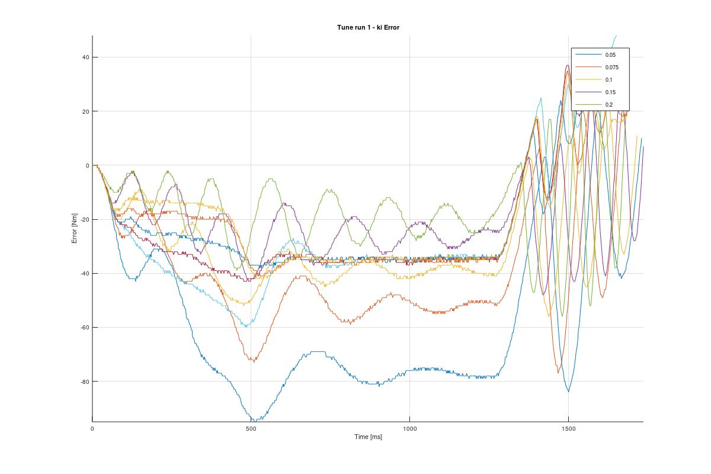

**Reference Value**: kp0.02, ki0.1, kd0.0002

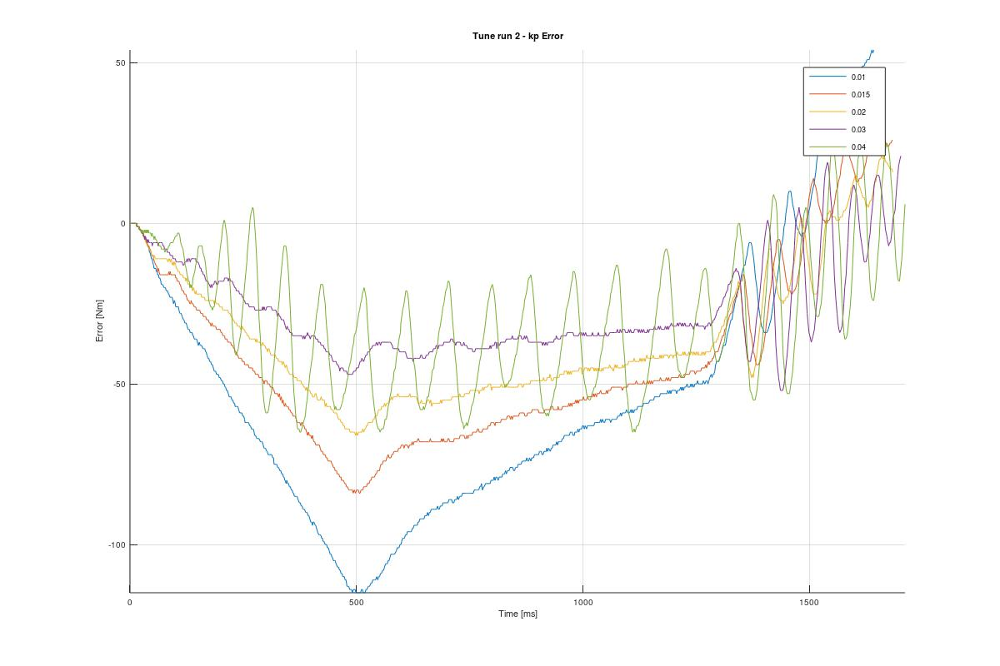

**Observation:** Acceleration phase started to oscillate at `kp=0.04` . We therefore reduce its value to `kp=0.01` for next step

### Round 2

Increasing ki

**Reference Value**: kp0.01, ki0.01, kd0.0002 (Smaller ki)

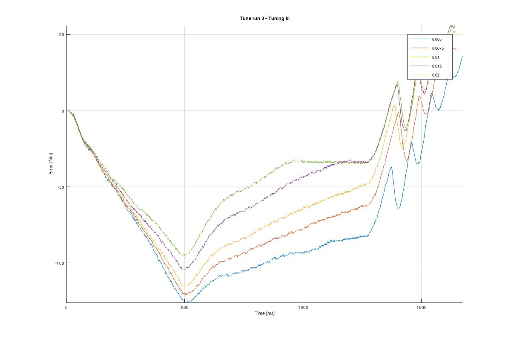

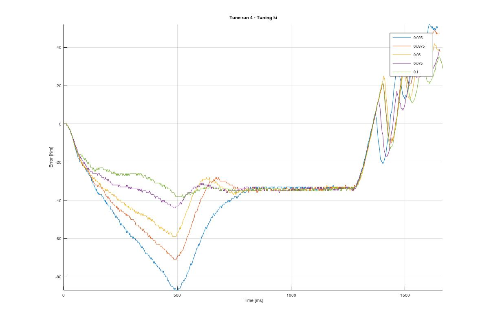

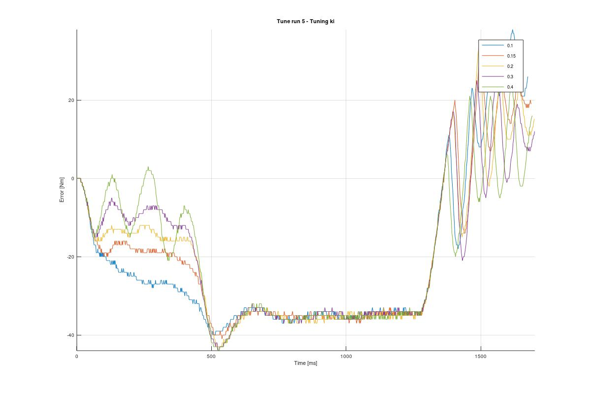

**Observation:** Acceleration phase starts to oscillate at `ki=0.3`. We can reduce this value back by 2-4 times. Using `ki=0.1` as reference value.

### Round 3

Tune derivative

**Reference Value**: kp0.01, ki0.1, kd0.0002

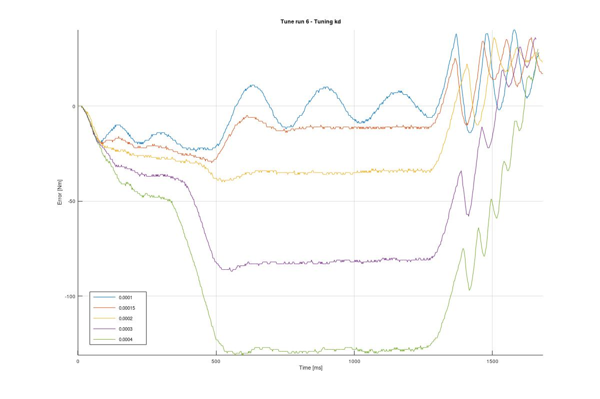

Observation: For the sake of smooth motion, `kd=0.0002` is a good compromise between steady state error and smooth acceleration.

### Final Confirm

**Reference Value**: kp0.01, ki0.1, kd0.0002

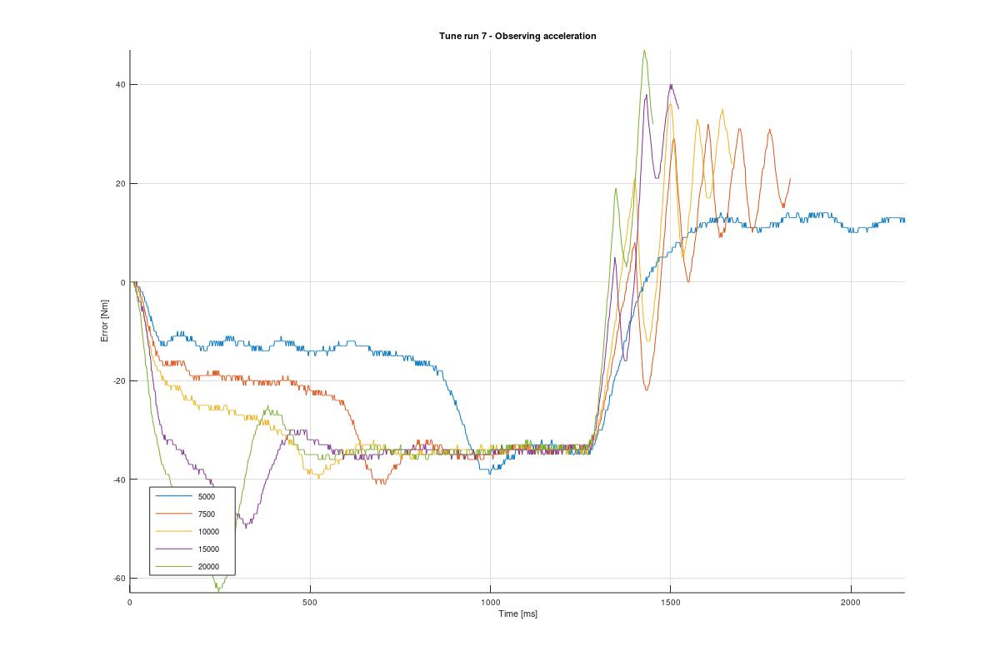

Steady State Error around 35 steps. 

## Alternate Tune (Larger kp to reduce steady state error)

Attempt to reduce steady state error by increasing from `kp=0.01` to `kp=0.02`

**Reference Value**: kp0.02, ki0.1, kd0.0002

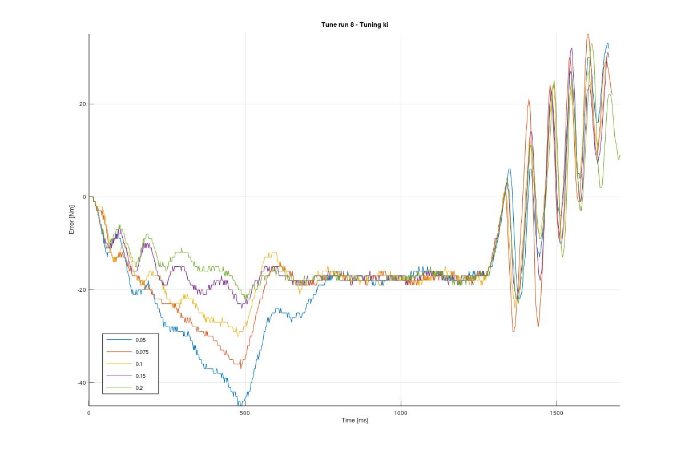

Observation: Larger `ki` value (green line) seems to reduce the overshoot at the end of acceleration phase.

The steady state error can be kept at 20 steps. However, compare with the previous tune with`kp=0.01`, it has a more oscillation at the acceleration phase.

## Conclusion

Different from typical PID set point tunning. Our system of chasing a moving target changes the behavior of terms. In particular

- Larger `kp` reduces constant speed phase error (more substantial than `ki`)
- `ki` have no effect on the constant speed phase error (as opposed to typical system)
- Larger `kd` reduce oscillation, however introduce steady state error substantially (look at round 3 derivative tune)

The PID values chosen for the SL1 main motor will be `kp=0.01, ki=0.1, kd=0.0002`.

Recommended velocity is `v4548.48` : 4548.48 steps/s (0.8 mm/s) and acceleration is `a10000` : 10000 step/s^2